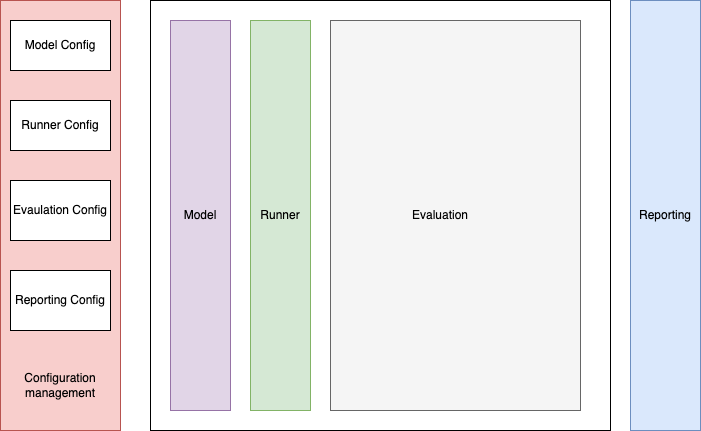

# AIAuditor

**AI Auditor** is an open-source framework designed to automate the testing and evaluation of AI models. It provides a comprehensive architecture for defining audit configurations, running tests, analyzing results, and generating reports.  
  
Traditionally, testing AI models involves complex, subjective evaluations. AI Auditor changes that by introducing a revolutionary approach - leveraging a second Large Language Model (LLM) for distance-based scoring. This innovative framework empowers you to:  

- **Automate AI testing**: Define clear audit configurations with pre-defined and programmatic inputs/outputs for consistent evaluation.  
- **Achieve objective scoring**: The second LLM objectively assesses the discrepancy between the AI model's output and the desired outcome, eliminating human bias.  
- **Gain deeper insights**: Generate detailed reports highlighting identified issues, distance scores, and areas for improvement.  
   
AI Auditor goes beyond basic testing, providing a comprehensive and reliable solution for building trust in your AI models.   

## Key Features  

- **Configurable Audits**: Define audits with pre-defined and programmatic inputs/outputs for flexible testing scenarios.  
- **Modular Architecture** : Leverage separate components for configuration management, test execution, evaluation, and reporting.  
- **Distance-Based Scoring** : Employ a second LLM to calculate the distance between desired and actual outputs for objective scoring.  
- **Detailed Reports** : Generate comprehensive reports summarizing audit results, identified discrepancies, and scores.  
  
## Architecture:  
  
The core architecture of AI Auditor consists of several interacting components:  
  
- **Audit Config**: This component defines the configuration for a specific audit. It includes:
- **Pre-defined inputs**: Specific data or prompts to be fed to the AI model under test.
- **Programmatic input generation**: Python or similar code to dynamically generate inputs based on specific criteria.
- **Desired outputs**: Expected outputs from the AI model for the provided inputs. These can be pre-defined text, data structures, or scoring criteria.
- **Configuration Management**: This component manages and stores audit configurations, allowing for easy creation, modification, and version control.
- **Runner**: This component executes the AI model under test according to the specified configuration. It provides the defined inputs to the model and captures the generated outputs.
- **LLM Evaluator**: This component utilizes a second Large Language Model (LLM) to compare the AI model's outputs with the desired outputs from the configuration. It calculates a distance score based on the closeness of the outputs, indicating potential discrepancies.
- **Reporting**: This component generates comprehensive reports summarizing the audit results. It includes:  
  - Tested AI model and configuration details.  
  - Pre-defined and programmatic inputs used.  
  - Desired outputs from the configuration.  
  - Actual outputs generated by the AI model under test.  
  - Distance score calculated by the LLM Evaluator.  
  - Identified discrepancies or areas for improvement.  

    
## Benefits:

- Standardizes and simplifies AI model testing procedures.
- Enables objective and consistent evaluation through distance-based scoring.
- Improves transparency and interpretability of AI model behavior.
- Generates detailed reports for informed decision-making.
